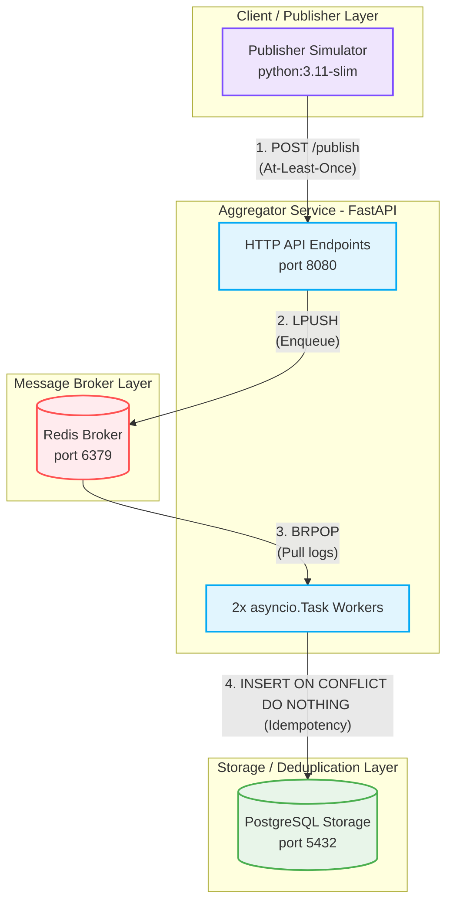

# Pub-Sub Log Aggregator Terdistribusi

> UAS SISTER PARALEL DAN TERDISTRIBUSI — Idempotent Consumer + Persistent Deduplication dengan PostgreSQL dan Redis

Link YouTube (Demo):

Link Dokumen Laporan:

---

## Arsitektur Sistem

Berikut adalah diagram arsitektur multi-service dari Pub-Sub Log Aggregator Terdistribusi ini:

### Mermaid Diagram (Auto-Render di GitHub)

<details>
<summary><b>Klik untuk melihat kode Mermaid / Diagram Alir</b></summary>



</details>

### ASCII Diagram

```
┌─────────────────── Docker Compose Network (internal) ───────────────────┐
│                                                                          │
│  ┌──────────────┐   POST /publish   ┌──────────────────────────────┐    │
│  │  publisher    │─────────────────▶│     aggregator (port 8080)   │    │
│  │  (one-shot    │                  │     FastAPI + Uvicorn         │    │
│  │   simulator)  │                  │                              │    │
│  └──────────────┘                   │  ┌────────────────────────┐  │    │
│                                     │  │  Schema Validation     │  │    │
│                                     │  │  (Pydantic v2)         │  │    │
│                                     │  └────────┬───────────────┘  │    │
│                                     │           │ LPUSH            │    │
│  ┌──────────────┐                   │  ┌────────▼───────────────┐  │    │
│  │  broker       │◀────────────────│  │  Redis Queue           │  │    │
│  │  (Redis 7)    │ BRPOP ─────────▶│  │  (message broker)      │  │    │
│  │  Volume:      │                  │  └────────┬───────────────┘  │    │
│  │  broker_data  │                  │           │ consume()        │    │
│  └──────────────┘                   │  ┌────────▼───────────────┐  │    │
│                                     │  │  Idempotent Consumer   │  │    │
│                                     │  │  (2 async workers)     │  │    │
│  ┌──────────────┐                   │  └────────┬───────────────┘  │    │
│  │  storage      │◀────────────────│           │ INSERT ... ON    │    │
│  │  (Postgres 16)│                  │           │ CONFLICT DO      │    │
│  │  Volume:      │                  │           │ NOTHING           │    │
│  │  pg_data      │                  │  ┌────────▼───────────────┐  │    │
│  └──────────────┘                   │  │  DedupStore            │  │    │
│                                     │  │  (PostgreSQL)          │  │    │
│                                     │  │  PK: (topic, event_id) │  │    │
│                                     │  └────────────────────────┘  │    │
│                                     └──────────────────────────────┘    │
│                                                                          │
│  GET /events, GET /stats, GET /health → aggregator:8080                 │
└──────────────────────────────────────────────────────────────────────────┘
```

---

## Fitur Utama

- **Arsitektur Multi-Service** — Terdiri dari aggregator, publisher, broker (Redis), dan storage (PostgreSQL).
- **POST /publish** — Terima single event atau batch dari publisher.
- **GET /events** — Daftar event unik yang telah diproses.
- **GET /stats** — Statistik real-time yang konsisten (received, unique, duplicates, uptime).
- **Idempotent consumer** — Event yang sama tidak diproses lebih dari sekali berkat atomicity `INSERT ... ON CONFLICT DO NOTHING`.
- **Persistent dedup store** — Data aman meski container direstart atau di-_recreate_ berkat named volume PostgreSQL.
- **Message Broker** — Redis bertindak sebagai _buffer_ yang andal untuk lalu lintas antar komponen.

---

## Struktur Direktori

```
uts-aggregator/
├── src/
│   ├── main.py          # FastAPI app, endpoints, lifespan (Aggregator)
│   ├── models.py        # Pydantic Event model + validation
│   ├── dedup_store.py   # PostgreSQL-backed deduplication store
│   └── queue_manager.py # Redis list + idempotent consumer
├── publisher/
│   ├── main.py          # Standalone publisher simulator dengan retry backoff
│   ├── requirements.txt # Dependensi publisher
│   └── Dockerfile       # Publisher image (non-root, python:3.11-slim)
├── tests/
│   └── test_aggregator.py  # 16 unit/integration tests (concurrency, dedup, stress)
├── k6/
│   ├── load_test.js     # Script load testing
│   └── README.md        # Instruksi K6
├── Dockerfile           # Aggregator image (non-root, python:3.11-slim)
├── docker-compose.yml   # 4 services stack (aggregator, publisher, broker, storage)
├── requirements.txt     # Dependensi aggregator
├── report.md            # Laporan teori T1–T10 + metrik + sitasi
└── README.md            # File ini
```

---

## Cara Build & Run

Aplikasi ini dirancang untuk dijalankan menggunakan **Docker Compose** yang akan menjalankan seluruh topologi sistem (aggregator, publisher simulator, Redis, dan PostgreSQL).

```bash
# Build images & jalankan seluruh stack
docker compose up --build -d

# Lihat status services
docker compose ps

# Lihat log real-time
docker compose logs -f

# Hentikan semua service
docker compose down
```

---

## Menjalankan Unit Tests

Sistem ini memiliki **16 tes** yang komprehensif, mencakup pengujian konkurensi (race condition), validasi skema, idempotency, dan persistensi.

```bash
# Instal dependencies
pip install -r requirements.txt

# Pastikan PostgreSQL dan Redis sudah berjalan (docker compose up -d storage broker)
# Jalankan tes dengan mengatur PYTHONPATH agar modul 'src' terbaca:

# Di PowerShell (Windows):
$env:PYTHONPATH="."
pytest tests/ -v

# Di Bash / Linux / macOS / Git Bash:
export PYTHONPATH=.
pytest tests/ -v
```

---

## Load Testing dengan K6

Sistem dapat diuji beban untuk memastikan kemampuannya menangani minimal 20.000 events.
Referensi penggunaan K6: [GitHub K6](https://github.com/grafana/k6) | [Contoh penggunaan](https://github.com/grafana/k6/tree/master/examples)

**Jika K6 terinstal secara lokal di komputer:**

```bash
k6 run k6/load_test.js
```

**Jika menggunakan Docker di Windows PowerShell:**

```powershell
Get-Content k6/load_test.js | docker run -i --rm -e AGGREGATOR_URL=http://host.docker.internal:8080 grafana/k6 run -
```

**Jika menggunakan Docker di Git Bash / WSL / Linux:**

```bash
docker run -i --rm -e AGGREGATOR_URL=http://host.docker.internal:8080 grafana/k6 run - < k6/load_test.js
```

> [!TIP]
> **Catatan Pengguna Windows (PowerShell):**
> Secara default, PowerShell memiliki alias `curl` yang merujuk ke cmdlet `Invoke-WebRequest` yang memiliki parameter berbeda dari cURL asli.
>
> - Gunakan **`curl.exe`** alih-alih `curl` agar memanggil binary cURL asli di Windows.
> - Atau gunakan syntax cmdlet asli PowerShell (`Invoke-RestMethod`), contoh:
>   `Invoke-RestMethod -Uri "http://localhost:8080/publish" -Method Post -ContentType "application/json" -Body '{"topic":"test", "event_id":"TEST-001"}'`

## Endpoint API

### `POST /publish`

Terima single event atau batch.

**Single event:**

```bash
curl -X POST http://localhost:8080/publish \
  -H "Content-Type: application/json" \
  -d '{
    "topic": "logs.app.error",
    "event_id": "550e8400-e29b-41d4-a716-446655440000",
    "timestamp": "2024-01-01T10:00:00+00:00",
    "source": "service-A",
    "payload": {"level": "ERROR", "message": "Database Timeout"}
  }'
```

**Batch:**

```bash
curl -X POST http://localhost:8080/publish \
  -H "Content-Type: application/json" \
  -d '{
    "events": [
      {"topic": "logs.app", "event_id": "evt-001", "timestamp": "2024-01-01T10:00:00Z", "source": "svc-a", "payload": {}},
      {"topic": "logs.app", "event_id": "evt-002", "timestamp": "2024-01-01T10:00:01Z", "source": "svc-a", "payload": {}}
    ]
  }'
```

### `GET /events?topic=<topic>`

```bash
# Semua event unik
curl http://localhost:8080/events

# Filter by topic
curl "http://localhost:8080/events?topic=logs.app.error"
```

### `GET /stats`

```bash
curl http://localhost:8080/stats
# Response:
# {
#   "received": 27000,
#   "unique_processed": 20000,
#   "duplicate_dropped": 7000,
#   "topics": ["topic.A", "topic.B", "topic.C", "topic.D", "topic.E"],
#   "queue_size": 0,
#   "uptime_seconds": 65.3
# }
```

### `GET /health`

```bash
curl http://localhost:8080/health
```

---

## Demonstrasi Idempotency & Deduplication Secara Manual

```bash
# Kirim event yang sama 3 kali (Event ID: SAME-ID-001)
for i in {1..3}; do
  curl -s -X POST http://localhost:8080/publish \
    -H "Content-Type: application/json" \
    -d '{"topic":"demo","event_id":"SAME-ID-001","timestamp":"2024-01-01T00:00:00Z","source":"test","payload":{}}'
done

# Cek stats: hanya 1 event diproses, 2 di-drop sebagai duplikat
curl http://localhost:8080/stats
# "unique_processed": 1, "duplicate_dropped": 2
```

---

## Asumsi & Batasan

1. **Jaringan Internal** — Broker (Redis) dan Storage (PostgreSQL) hanya dapat diakses melalui jaringan internal Docker. Hanya API aggregator yang diekspos melalui port 8080.
2. **Tanpa Autentikasi** — API bersifat publik dalam pengembangan lokal. Pada tahap produksi, tambahkan kapabilitas token (contoh: JWT) atau API Key.
3. **Ordering** — Karena diimplementasikan pada sistem terdistribusi asinkron, sistem mengandalkan _partial ordering_ via `processed_at` atau `timestamp` milik event. _Total ordering_ global tidak digunakan karena berdampak negatif pada performa _throughput_.

---

## Referensi Utama

Coulouris, G., Dollimore, J., Kindberg, T., & Blair, G. (2012). _Distributed systems: Concepts and design_ (5th ed.). Pearson.
